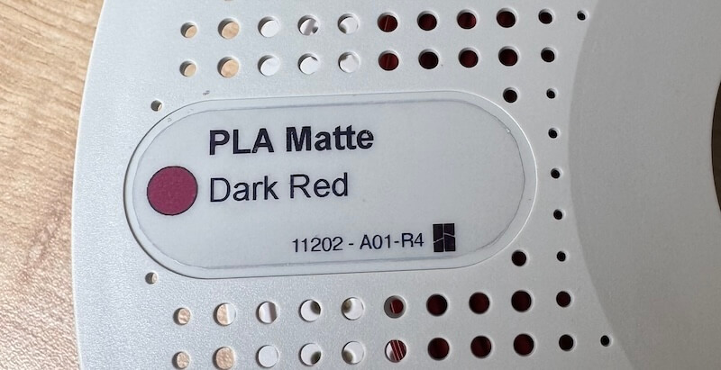

# Filament Spool Label Generator

A browser-based tool that generates printable labels for filament spools. Filaments from many manufacturers look nearly identical on the shelf — this tool creates labels showing the **material**, **color name**, and a **color swatch** so you can identify your spools at a glance.

**[Open the app](https://bemble.github.io/filament-spool-label-generator/)**



## Usage

1. Select a **manufacturer** from the list, or pick **Other from Spoolman DB…** to load any manufacturer by ID
2. Pick a **template** (built-in or your own SVG)
3. Choose one or more **materials** and click **Generate Labels**
4. Optionally use **Selection** mode to exclude individual colors
5. Hit **Print**

## Local development

```sh
python3 -m http.server -d src/ 8080
```

Then open [http://localhost:8080](http://localhost:8080).

## Data sources

Manufacturer data comes from two sources, both declared in `src/list.json`:

- **Custom** — hand-curated JSON arrays (e.g. Bambu Lab via [piitaya/bambu-spoolman-db](https://github.com/piitaya/bambu-spoolman-db))
- **SpoolmanDB** — [Donkie/SpoolmanDB](https://github.com/Donkie/SpoolmanDB); a list of enabled manufacturer IDs is declared under `manufacturers_enabled`. Any SpoolmanDB manufacturer can also be loaded at runtime by entering its ID in the **Other from Spoolman DB…** input (the ID is the filename without `.json` in the [filaments folder](https://github.com/Donkie/SpoolmanDB/tree/main/filaments)).

### Adding a manufacturer to the list

Edit `src/list.json`. SpoolmanDB entries can be a plain string (the ID; name is auto-capitalised) or an object with explicit `id` and `name`:

```json
{
  "spoolman-db": {
    "manufacturers_enabled": [
      "prusament",
      { "id": "esun", "name": "eSun" }
    ]
  },
  "custom": [
    {
      "id": "my-brand",
      "name": "My Brand",
      "dataUrl": "https://example.com/filaments.json",
      "credits": { "label": "author", "url": "https://github.com/author/repo" },
      "templates": [
        { "id": "default", "name": "Default", "url": "./templates/label-my-brand-default.svg" }
      ]
    }
  ]
}
```

Custom manufacturer JSON at `dataUrl` must be an array of objects with at least: `material`, `color_name`, `color_hex`, `code`, `id`.

## Custom templates

Select **Use your template…** in the template selector, then drag and drop an SVG file onto the upload area or use the file picker.

Your file is never uploaded — everything stays in your browser.

### Field mapping

Add `data-label="<value>"` to any SVG element to have it filled in automatically:

| `data-label` value | Injected content |
|---|---|
| `manufacturer` | Manufacturer name, e.g. `eSun` |
| `material` | Material name (brackets stripped), e.g. `PLA Basic` |
| `color` or `color_badge` | Element `fill` set to the filament's hex color |
| `color_name` | Color name, e.g. `Maroon Red` |
| `color_code___id` | Code and ID (Bambu Lab specific), e.g. `10205 - A00-R2` |

The SVG `width` and `height` attributes set the print size (e.g. `width="44mm" height="18mm"`).
